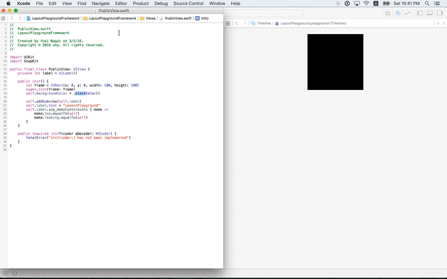

# LayoutPlayground
Use a playground to layout iOS views without storyboards.

## Structure

## Steps
### 1. Workspace
1. Create a workspace in a directory.

### 2. Application Project
1. Create an application project in the directory.
2. Add the project to the workspace.

### 3. Application Framework
1. Create an application framework in the directory.
2. Add the framework to the workspace.

### 4. playground
1. Create a playground in the directory.
2. Add the playground to the workspace.
3. Build the application framework.
4. Import the framework into the playground.

### 5. SnapKit
1. Add `github "SnapKit/SnapKit"` in the `Cartfile` for the framework.
2. `carthage update`
3. Follow the steps of [Adding frameworks to unit tests or a framework](https://github.com/Carthage/Carthage#adding-frameworks-to-unit-tests-or-a-framework).
4. The "Copy Files" build phase is also needed.

### 6. Edit Public UIView
1. Create a public UIView in the framework.
2. Write a code for layout.
3. Build the framework.
4. Execute the playground.

## Guide
* Application projects cannot be used in a playground.
* Application frameworks need to have "Copy Files" build phase for Carthage frameworks.
